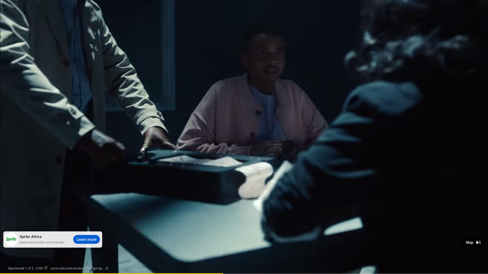
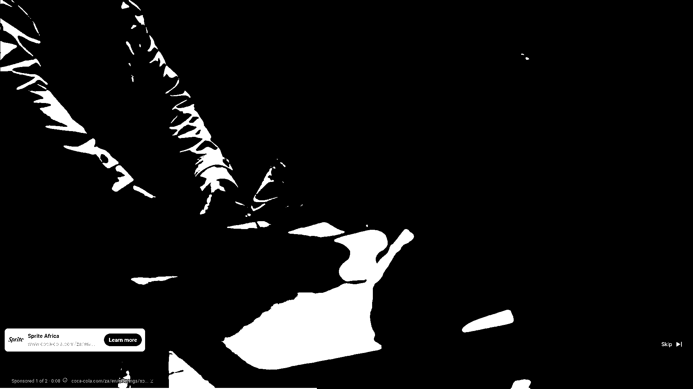
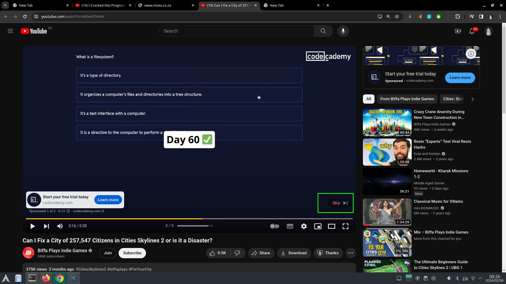
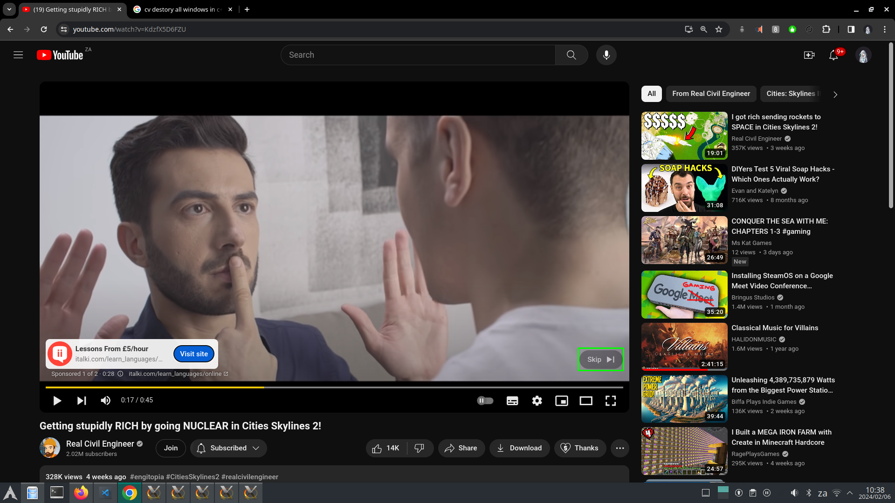
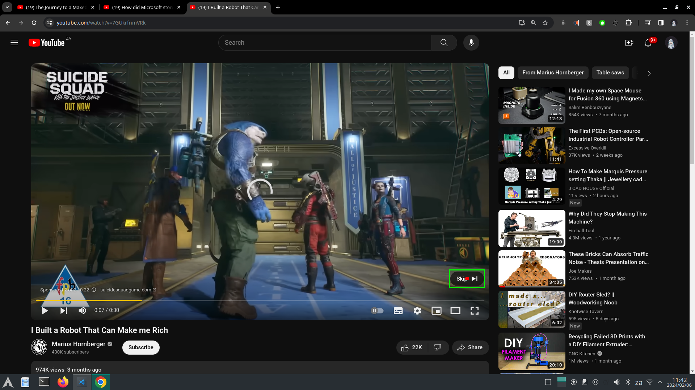
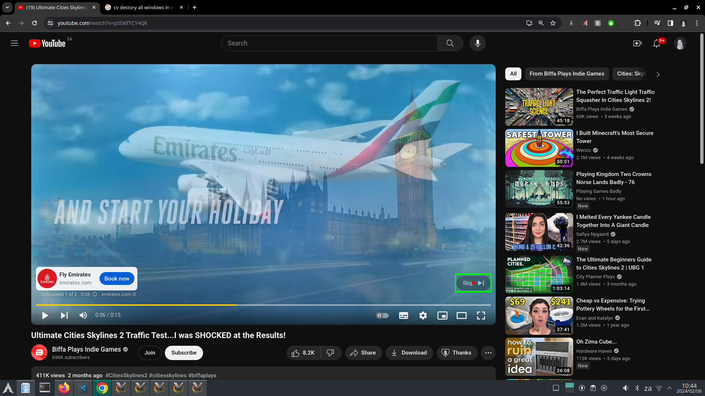
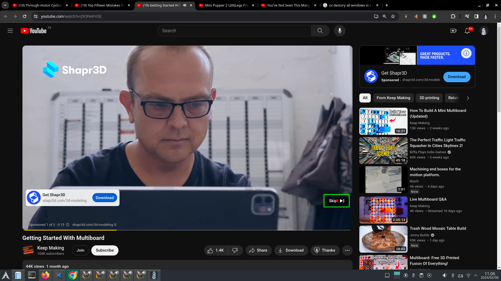
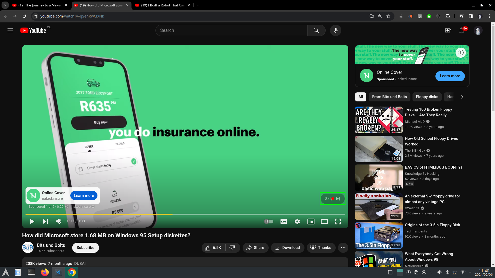
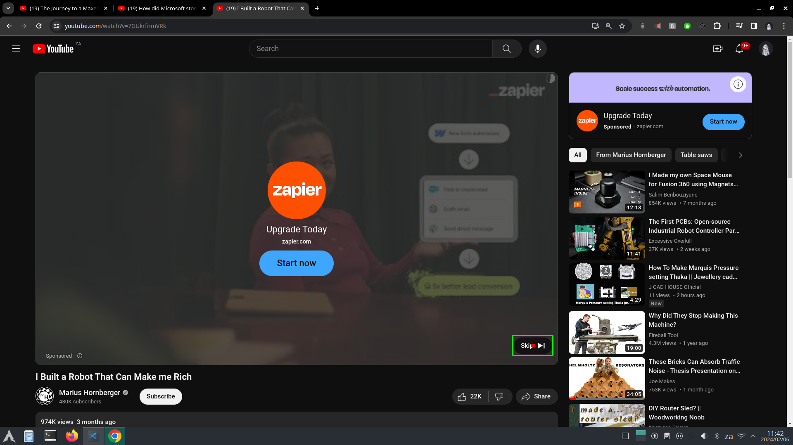

# skipAd

This is a simple implementation utilizing OpenCV template matching and Tesseract OCR for automatically clicking the "Skip" button as soon as it appears on YouTube.

## Technology Used

- OpenCV
- Tesseract OCR (Optical Character Recognition)

## Why not just use adblock?

Using adblock might violate the YouTube user agreement.

## Why not write a native browser plugin?

While a native plugin could scan the site for an input with the text "Skip" and send a click event, this approach specifically applies OpenCV for preprocessing and template matching, followed by OCR to confirm the Region of Interest (ROI) contains the actual text "skip".

### How it Works

1. **OpenCV**: Utilizes OpenCV for preprocessing and template matching.
   - Template Image: 
   - Grayscale Image: 
   - Binary Image: 
   - Binary imaged is used to template match in the Binary Screenshot (below)

2. **Tesseract OCR**: Applies Tesseract OCR to confirm the ROI contains the text "skip".
   - Screenshot Image: 
   - Binary Screenshot: 
   - ROI Image: 
   - Inverted Image: 
   - OCR recognizes: OCR Result: skip »)

### How Well Does it Work?

It's challenging to evaluate due to YouTube's measures to prevent overexposure to ads. After clicking "Skip" quickly a few times, YouTube may temporarily remove ads. However, it's notable that the ad algorithm likely prevents users from being inundated with ads in a short timeframe. For instance, after watching a few ads and then changing videos, users may not be shown more ads on every new video.

## Possible Considerations

- The click location is calculated at the exact center of the ROI.
- Consider adding randomized mouse movement to the location and make the click within the center 65% of the ROI to simulate human interaction with the mouse, potentially making it harder for trackers to distinguish.

## Future Enhancements

A potential enhancement could involve running YouTube ads in a separate window on a virtual screen, allowing them to run automatically every few minutes. This could reduce the likelihood of ads appearing on other tabs on YouTube. However, while feasible, this approach might be considered more unethical than the current solution, which aims to skip ads manually to avoid interruptions while watching videos.

---

By LeAnn Alexandra, 2024

## Some Proof Pictures for showing template match result along with click position:
Proof Image: 
Proof Image: 
Proof Image: 
Proof Image: 
Proof Image: 
Proof Image: 
Proof Image: 
